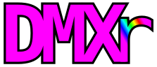

<p align="center">
  
</p>

<p align="center">
  Control your DMX lighting fixtures from <a href="https://signalrgb.com">SignalRGB</a> — sync stage lights, PARs, moving heads, and strobes with your PC lighting effects.
</p>

<p align="center">
  <a href="https://github.com/thewrz/DMXr/actions/workflows/ci.yml"></a>
  <a href="https://github.com/thewrz/DMXr/actions/workflows/build-server.yml"></a>
  <a href="https://github.com/thewrz/DMXr/blob/main/LICENSE"></a>
</p>

> Currently targets SignalRGB (Windows). [OpenRGB](https://openrgb.org) support for native Linux is planned.

[](https://srgbmods.net/s?p=addon/install?url=https://github.com/thewrz/DMXr)

## What it does

- Turns any DMX fixture into a draggable tile on the SignalRGB canvas
- RGB color mapping with automatic white extraction for RGBW fixtures
- **Multi-universe support** — manage multiple DMX adapters with per-universe fixture assignment
- **Movement control** — pan/tilt interpolation for moving heads, driven by canvas position
- **Per-fixture color calibration** — gain and offset tuning per RGB channel
- **Channel remapping** — remap any channel to a different function with saveable presets
- **Fixture grouping** — organize fixtures into groups for bulk control operations
- **Multi-select** — marquee drag-select on the DMX grid with batch move, delete, and group operations
- Strobe-only fixtures (no RGB) are white-gated — they only fire on near-white input
- Per-channel overrides let you lock individual channels (strobe speed, gobo, macros) from the web UI while SignalRGB drives everything else
- Motor guard protects pan/tilt channels on moving heads during blackout/whiteout
- Multi-server — run multiple DMXr instances on different machines; the plugin discovers and manages all of them
  - Tested over Wi-Fi with a RaspberryPi 5 with sub 30ms latency and no UDP packet loss!
- UDP color transport for lower-latency updates (falls back to HTTP automatically)
- Resilient USB connection — survives unplug/replug with automatic reconnect, state replay, and real-time UI status
- Guaranteed blackout on shutdown

## Web Manager

The built-in web UI at `http://localhost:8080` provides:

- **DMX grid** — visual 512-channel map with drag-to-readdress, fixture color coding, and hover tooltips
- **Live DMX monitor** — real-time channel values streamed via SSE
- **Connection log** — hardware connect/disconnect/reconnect events with timestamps
- **DMX hardware indicator** — top-bar badge showing adapter status (connected/disconnected/reconnecting) in real-time
- **Fixture library browser** — search and browse the Open Fixture Library (15,000+ fixtures) with offline caching
- **Custom fixture builder** — create fixture definitions from scratch with a template system
- **Configuration backup/restore** — export and import your entire setup
- **Onboarding tour** — guided walkthrough for new users
- **Setup wizard** — auto-detects your DMX adapter and walks you through first-time configuration

## Hardware & fixture support

Tested with an **ENTTEC DMX USB Pro** and **Open DMX USB** (FTDI-based) adapters. However the low cost FTDI adapters that don't address DMX timing natively are very finnicky. Devices in the class of the ENTTEC DMX USB Pro are worth their money.

Fixtures tested: RGB PAR cans, RGBW moving heads (with pan/tilt), fog machines, white strobes, and scanning lasers. The color pipeline handles RGB, RGBW, dimmer-only, strobe-only, and multi-channel fixtures. If you try it with something else and it works (or doesn't), let me know.

## Architecture

- **Node.js server** (Fastify) — fixture management, DMX output, web UI at `http://localhost:8080`
- **SignalRGB plugin** — discovers servers via mDNS, sends canvas colors over UDP (with HTTP fallback)
- **DMX output** via `dmx-ts` — supports ENTTEC DMX USB Pro and Open DMX USB (FTDI) drivers

## Fixture Libraries

- **Open Fixture Library** — community database at [open-fixture-library.org](https://open-fixture-library.org) with offline disk cache
- **Local fixture databases** — auto-detects compatible third-party databases on the system
- **Custom fixtures** — build your own fixture definitions with the built-in template editor

## Setup

### Plugin (SignalRGB)

Click **Add to SignalRGB** at the top of this page to auto-install the plugin. After install, restart SignalRGB and enable DMXr under **Settings → Plugins**.

**Manual install**: Copy `DMXr.js` and `DMXr.qml` from the repo root to `Documents\WhirlwindFX\Plugins\`.

### Server

**Option A — Portable (recommended):**
Download `DMXr-Server-win-x64.zip` from the
[latest release](https://github.com/thewrz/DMXr/releases/latest),
extract anywhere, and double-click `DMXr-Server.bat`.

**Option B — From source:**
```bash
cd server
npm install
npm start
```

Add fixtures through the web UI at `http://localhost:8080`.

### Environment Variables

| Variable | Default | Description |
|----------|---------|-------------|
| `PORT` | `8080` | HTTP server port |
| `HOST` | `127.0.0.1` | Bind address |
| `DMX_DRIVER` | `null` | `null`, `enttec-usb-dmx-pro`, or `enttec-open-usb-dmx` |
| `DMX_DEVICE_PATH` | `auto` | Serial port (`COM3`, `/dev/ttyUSB0`) or `auto` for detection |
| `FIXTURE_DB_PATH` | *(auto-detect)* | Path to a local fixture database file |
| `FIXTURES_PATH` | `./config/fixtures.json` | Persisted fixture configuration |
| `MDNS_ENABLED` | `true` | Advertise via mDNS |
| `LOG_FORMAT` | `pretty` | Set to `json` for structured JSON logs (machine-parseable) |
| `API_KEY` | *(none)* | Optional API key for endpoint auth |

### Running as a service

Windows (NSSM):
```bash
nssm install DMXr node.exe tsx src/index.ts
nssm set DMXr AppDirectory C:\path\to\DMXr\server
nssm start DMXr
```

Linux (systemd): see `service/dmxr.service`.

## Troubleshooting

**Server won't detect my DMX adapter**
- Set `DMX_DEVICE_PATH=auto` (default) for automatic detection, or specify the port manually
- Only one process can hold the serial port. Close any other DMX software first
- Try unplugging and replugging the adapter; the port number may change

**Fixtures aren't responding to color changes**
- Verify the fixture's DMX start address matches what's configured in the web UI
- Check that the correct driver is set (`enttec-usb-dmx-pro` or `enttec-open-usb-dmx`)
- Open the DMX monitor at `http://localhost:8080` to see live channel values

**SignalRGB plugin can't find the server**
- Ensure `MDNS_ENABLED=true` (default) and that your firewall allows UDP port 5353 (mDNS)
- If mDNS fails, the plugin falls back to manual server probing — add the server IP in the plugin settings panel
- Restart SignalRGB after installing or updating the plugin

**Connection drops or "disconnected" status**
- The server auto-reconnects on USB disconnect/reconnect with exponential backoff
- Check the DMX hardware indicator in the top bar and connection event log for diagnostics
- On Windows VMs, USB passthrough re-enumeration requires reattaching the device

**Web UI won't load**
- Default is `http://localhost:8080` — check `PORT` and `HOST` env vars
- If running as a service, check logs: NSSM logs at `%AppData%\DMXr\logs\`, systemd via `journalctl -u dmxr`

## Development

```bash
cd server
npm test          # Run tests (1450+)
npx tsc --noEmit  # Type check
```

## Acknowledgments

DMXr is built on the work of these open-source projects:

- **[dmx-ts](https://github.com/node-dmx/dmx-ts)** — Node.js DMX library with ENTTEC USB Pro driver support. The backbone of all DMX output in this project.
- **[Open Fixture Library](https://open-fixture-library.org)** — Community-maintained database of DMX fixture definitions. Powers the OFL browser and fixture import in the web UI.
- **[Alpine.js](https://alpinejs.dev)** — Lightweight reactive framework that drives the entire web manager UI without a build step.
- **[bonjour-service](https://github.com/onlxltd/bonjour-service)** — mDNS/Zeroconf implementation used for automatic server discovery by the SignalRGB plugin.
- **[NSSM](https://nssm.cc)** — The Non-Sucking Service Manager, used to run DMXr as a Windows service with auto-restart.
